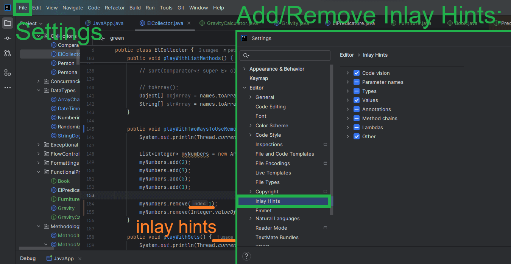

# PT_Demo_Java

# Contents
- [TODO](#todo)
- [Questions](#questions)
- [Setup](#setup)
  - [Essential Project Setup](#essential-project-setup)
  - [Additional IDE Settings](#additional-ide-settings)
- [Create Modules](#create-modules)
  - [Create new Module](#create-new-module)
  - [Create new Transitive Module](#create-new-transitive-module)
- [JDBC with Postgres](#jdbc-with-postgres)
- [Testing with JUnit](#testing-with-junit)
- [Build Artifact and Run Program](#build-artifact-and-run-program)
  - [Build Artifact](#build-artifact)
  - [Run Program](#run-program)
- [C# vs. Java](#c-vs-java)
- [Notes](#notes)
- [Shortcuts](#shortcuts)
- [Links](#links)
- [Course Contents](#course-contents)
  - [S2: Data Types](#data-types)
    - [Wrapper Classes](#wrapper-classes)
    - [Special Words](#special-words)
  - [S3: Operators](#operators)
    - [Unary Operators](#unary-operators)
    - [Binary Operators](#binary-operators)
    - [Assignment Operators](#assignment-operators)
    - [Comparison Operators](#comparison-operators)
  - [S11: Lambdas and Functional Programming](#lambdas-and-functional-programming)
    - [Method References](#method-references)
    - [Functional Interfaces](#functional-interfaces)
    - [Common Functional Interfaces for Primitives](#common-functional-interfaces-for-primitives)
    - [Primitive Specific Functional Interfaces](#primitive-specific-functional-interfaces)
  - [S12: Collections](#collections)
    - [Map Methods](#map-methods)
    - [Compare Compares](#compare-compares)
  - [S13: Exceptions](#exceptions)
    - [Unchecked Exceptions](#unchecked-exceptions)
  - [S16: Streams](#streams)
    - [Optional](#optional)
      - [Common Optional Instance Methods](#common-optional-instance-methods)
    - [Stream Creation Methods](#stream-creation-methods)
    - [Terminal Stream Operations](#terminal-stream-operations)
    - [Unique Primitive Streams Methods](#unique-primitive-streams-methods)
    - [Mapping Streams](#mapping-streams)
    - [Common Spliterator Methods](#common-spliterator-methods)
    - [Common Grouping / Partitioning Collectors](#common-grouping--partitioning-collectors)
  - [S17: Localization](#localization)
    - [Common Date Time Symbols](#common-date-time-symbols)
    - [NumberFormat Factory Methods](#numberformat-factory-methods)
    - [DateTimeFormatter Factory Methods](#datetimeformatter-factory-methods)
  - [S18: Modules](#modules)
    - [module-info.java keywords](#module-infojava-keywords)
    - [Build-In Modules](#build-in-modules)
    - [JDK Modules](#jdk-modules)
  - [S19: Concurrency](#concurrency)
    - [Future\<V\> Interface Methods](#futurev-interface-methods)
    - [Atomic Classes](#atomic-classes)
    - [Common Atomic Methods](#common-atomic-methods)
    - [Lock Methods](#lock-methods)
    - [Concurrent Collection Classes](#concurrent-collection-classes)
    - [Synchronized Collections Methods](#synchronized-collections-methods)

# TODO
- Method, constructor, class access modifiers can be extracted in tables in README.
- Make a Thing:ImportPackage table.

# Questions
- Q1: Do we have BiConsumer<T, U> that accept(T, U, V, W, X) - more than 2 parameters?
  - A1: Implement manually:
```
@FunctionalInterface
public interface PentaConsumer<T,U,V,W,X> {
  void accept(T t, U u, V v, W w, X x);
  }
```
- Q2: ...
  - A2: ...

# Setup
## Essential Project Setup
1. Install IntelliJ IDEA Community (ideaIC-2024.2.4.exe) from https://www.jetbrains.com/idea/download/other.html
2. Open Existing Project (🔴 ERROR: Does not compile! Java JDK missing!)
3. Install JDK 17 Java Development Kit (jdk-17.0.12_windows-x64_bin) from https://www.oracle.com/java/technologies/javase/jdk17-archive-downloads.html
4. Go to Project > Structure > Choose Java 17 JDK:

5. Go to Run > More Actions > Configure > Choose Arguments args[0] and args[1], separated by comma:

6. Right click on any directory > Mark Directory As > **Sources Root**:


## Additional IDE Settings
1. Always select Opened File:

2. Turn on/off Inlay Hints:
   
3. Set Font Size: Go to Settings > Editor > Font > Change size to 16
4. Change Console Buffer Size:  
  

# Create Modules

Package is for organizing code.
Module is for managing and enforcing dependencies between groups of packages.

## Create new Module

1. Go to `File` > `Project Structure` > `Modules`.
2. Choose `[+] Add` > `New Module` > choose `Java`.
3. Choose the following settings and save in the same project directory:
- `Name`: (bookapi)
- `Location`: (PT_Demo_Java)
- `Build system`: IntelliJ
- `JDK`: 17
- [Y] Add sample code
4. Remove file `Main` from newly created module `bookapi`.
5. Create new package `com.bookapi` and new record `Runbook`:
```
package com.bookapi;
public record Runbook(String title) { }
```
6. Create new file `bookapi/src/module-info.java`:
```
module bookapi {
  exports com.bookapi;
}
```
7. In `JavaApp`, add dependency on module `bookapi`:
```
import com.bookapi.Runbook;
```
8. When the program runs, one can have the following 🔴 ERROR::
```
java: warning: source release 21 requires target release 21
```
To fix it, go to `File` > `Project Structure` > `Modules`, then go through all the modules and set `Language Level` to `17`.
9. ✅ SUCCESS: You are ready to use `Runbook` in `JavaApp`:
```
List<Runbook> myRunbooks = new ArrayList<>();
```

## Create new Transitive Module
1. Create new module `inventory`, containing package `com.inventory` in its `src` directory by following the instructions above.
2. Create new file `inventory/src/module-info.java`:
```
module inventory {
  requires transitive bookapi;    /* if some other module requires inventory, it automatically gets access to bookapi */
  exports com.inventory;          /* in order for com.inventory to be available in other modules */
  opens com.inventory to reports; /* makes com.inventory available to module reports in the runtime */
}
```

# JDBC with Postgres
1. Pull `postgres` Docker image and run it in a Docker container by following the instructions in [PT_Demo_PostgreSQL](https://github.com/petartotev/PT_Demo_PostgreSQL).
2. Try to connect to the `postgres` database through the Java codebase. The following error might appear:
```
🔴 ERROR: No suitable driver found for jdbc:postgresql://localhost:5432/phonebook_db?user=postgres?password=test1234
```
3. Download driver (e.g. postgresql-42.7.3.jar) from https://jdbc.postgresql.org/download/.
4. Move downloaded file to project directory.
5. Right click, choose 'Add as Library', select OK with default settings.
6. ✅ SUCCESS!

# Testing with JUnit
1. Make sure you have `JUnit` plugin installed:

2. Create new `UdemyJavaCertificatePrepTests` directory.
3. Right-click on `UdemyJavaCertificatePrepTests` > Mark Directory As > **Test Resources Root**.
4. Create new `FlowControllerTests` Java Class.
5. Download the following jar files from **Maven Central Repository**:  
[junit-jupiter-api@5.11.3](https://central.sonatype.com/artifact/org.junit.jupiter/junit-jupiter-api/versions)  
[junit-jupiter-engine@5.11.3](https://central.sonatype.com/artifact/org.junit.jupiter/junit-jupiter-engine/versions)  
[junit-platform-commons@1.11.3](https://central.sonatype.com/artifact/org.junit.platform/junit-platform-commons/versions)  
[junit-platform-engine@1.11.3](https://central.sonatype.com/artifact/org.junit.platform/junit-platform-engine/versions)  
6. Copy-paste the jar files into `UdemyJavaCertificatePrepTests` directory.
7. Right-click on each of these and choose "Add to Library".
8. Go to File > Project Structure > Libraries > you can check your added libraries:

9. Implement `FlowControllerTests` using JUnit `@Test` annotations.
10. Run `FlowControllerTests`.

# Build Artifact and Run Program
## Build Artifact
1. Go to File > Project Structure > Artifacts.
2. Press [+] > JAR > From modules with dependencies...
3. Select Main class, specify output directory and choose OK.

4. Next, go to Build > Build Artifacts... > Build (JAR).
5. Make sure you have a .JAR file populated in the chosen directory.


## Run Program
1. Copy-paste the populated JAR file on a Linux machine.
2. Install JDK by executing the following commands:
```
sudo apt update
sudo apt install openjdk-17-jdk
```
3. Make sure you have Java successfully installed:
```
java --version
```
4. Finally, run the program:
```
java -jar your-program.jar
```

# C# vs. Java

| Feature                               | C#                             | Java                                 |  |
|---------------------------------------|--------------------------------|--------------------------------------|--|
| Variable Naming                       | energyField // camelCase       | energyField // camelCase             |  |
| Constant Naming                       | EnergyField // PascalCase      | ENERGY_FIELD // SNAKE_CASE           |  |
| Class, Interface, Enum Naming         | class Student // PascalCase    | class Student // PascalCase          |  |
| Identifier Variable / Property Naming | Id { get; set; } // PascalCase | getId() // camelCase                 |  |
| Method Naming                         | GetStudents() // PascalCase    | getStudents() // camelCase           |  |
|                                       |                                |                                      |  |
| Importing Libraries                   | using System;                  | import java.util.Random;             |  |
| Documentation Comments                | `///`                          | `/** * * @author */`                 |  |
| Print to Console                      | `Console.WriteLine("abc")`     | `System.out.println("abc")`          |  |
| Random Number Generation              | `new Random().Next(0, 101)`    | `new Random().nextInt(101)`          |  |
| Constants                             | const string MyTest            | final String MY_TEST                 |  |
| Foreach Loops                         | foreach (var car in Cars) { }  | for (String car : cars) { }          |  |
| Base keyword                          | base.name                      | super.name                           |  |
| Region                                | #region //smth #endregion      | // <editor-fold desc="Section Name"> |🙁|

- Print current method name:
  - 🏆 C#: `Console.WriteLine(MethodBase.GetCurrentMethod().Name);`
  - Java: `System.out.println(Thread.currentThread().getStackTrace()[1].getMethodName());`
- Print List:
  - C#: `Console.WriteLine(string.Join(", ", myListStrings));`
  - 🏆 Java: `System.out.println(myListStrings)`
- Asynchronous Programming:
  - 🏆 C#: `async` and `await`

# Notes
- float x = 2.7 // does not compile! needs 'f' at the end
- bit size of boolean is not specified, depends on the machine
- LVTI (Local Variable Type Inference)

# Shortcuts
| Shortcut                     | Description                                        |
|------------------------------|----------------------------------------------------|
| Ctrl + D                     | Duplicate single line (Ctrl+C and Ctrl+V)          |
| Ctrl + Shift + Up/Down Arrow | Move line up / down                                |
| Ctrl + Shift + /             | Comment out multiple lines                         |
| Ctrl + Shift + [+/-]         | Expand / Collapse methods in a class               |
| Ctrl + Shift + R             | Replace                                            |
| Ctrl + Shift + F             | Search throughout the whole project                |
| Ctrl + Alt + L               | Format a file                                      |
| Alt + Insert                 | Shortcut for creating constructors, getters etc.   |
| Hold Alt and drag down/up    | Write on multiple lines                            |
| fori + tab                   | Automatically writes for (i = 0; i...              |
| sout + tab                   | Prints System.out.println();                       |
| soutp + tab                  | Prints method parameters                           |
| soutv + tab                  | Prints variable's name and value                   |
| psvm                         | Creates public static void main(String[] args) {}  |

# Links
- https://www.jetbrains.com/idea/download/other.html
- https://www.oracle.com/java/technologies/javase/jdk17-archive-downloads.html
- https://docs.oracle.com/en/java/javase/17/

# Course Contents

S01: Introduction  
.1. Introduction  

S02: Building Blocks [OCA, OCP]  
2. The Environment [OCA]  
3. Class Structure [OCA]  
4. The main() method [OCA]  
5. Packages [OCA]  
6. Compile, Run and Archive [OCA]  
7. Objects [OCA]  
8. Data Types [OCA]  
9. Text Blocks [OCP]  
10. Variables [OCA]  
11. Local Variable Type Inference (LVTI) [OCP]  
12. Garbage Collector [OCA]  

S03: Operators [OCA, OCP]  
13. Operators in Java [OCA]  
14. Unary Operators [OCA]  
15. Binary Operators [OCA]  
16. Assignment Operator [OCA]  
17. Comparison Operators [OCA]  

S04: Flow Control [OCA, OCP]  
18. If-Else Statement [OCA]  
19. Switch Statement [OCA]  
20. Switch Expression [OCP]  
21. While Loop [OCA]  
22. Do/While Loop [OCA]  
23. For Loop [OCA]  
24. For-Each Loop [OCA]  

S05: Strings [OCA, OCP]  
25. String Methods [OCA]  
26. StringBuilder [OCA]  
27. String Pool [OCA]  

S06: Arrays [OCA, OCP]  
28. Creating an Array [OCA]  
29. Sorting, Searching & Comparing Arrays [OCA]  
30. Multidimensional Arrays [OCA]  

S07: Date and Time [OCA, OCP]  
31. Creating Dates and Times [OCA]  
32. Methods on Dates and Times [OCA]  
33. Period, Duration, Instant [OCA]  

S08: Methods [OCA, OCP]  
34. Defining Methods [OCA]  
35. Local and Instance Variables [OCA]  
36. Variable Arguments (Varargs) [OCA]  
37. Access Modifiers [OCA]  
38. Static Members [OCA]  
39. Boxing and Unboxing [OCA]  
40. Overloading Methods [OCA]  

S09: Class Design [OCA, OCP]  
41. Inheritance [OCA]  
42. Creating Classes [OCA]  
43. Creating Constructors [OCA]  
44. Using this() and super() [OCA]  
45. Initializing Objects [OCA]  
46. Inheriting Members [OCA]  

S10: Abstract Classes & Interfaces [OCA, OCP]  
47. Abstract Classes [OCA]  
48. Interfaces [OCA]  

S11: Lambdas & Functional Programming [OCA, OCP]  
49. Functional Interfaces and Lambdas [OCA]  
50. Using Predicate with Lambda [OCA]  
51. Method References [OCP]  
52. Built-in Functional Interfaces [OCP]  
53. Combining Implementations [OCP]  
54. Functional Interfaces for Primitives [OCP]  

S12: Collections [OCA, OCP]  
55. Common Collection Methods [OCA]  
56. List Interface [OCA]  
57. Set Interface [OCP]  
58. Queue Interface [OCP]  
59. Deque Interface [OCP]  
60. Map Interface [OCP]  
61. Sorting Data [OCP]  

S13: Exceptions [OCA, OCP]  
62. Understanding and Handling Exceptions [OCA]  
63. Try-with-resources [OCP]  

S14: Math APIs [OCP]  
64. Math API Methods  

S15: Beyond Classes [OCP]  
65. Enums  
66. Sealed Classes  
67. Records  
68. Nested Classes  
69. Polymorphism  

S16: Streams [OCP]  
70. Using Optional  
71. Understanding Pipeline  
72. Creating Stream Source  
73. Terminating the Stream  
74. Using Intermediate Operations  
75. Putting The Pipeline Together  
76. Primitive Streams  
77. Spliterator  
78. Collecting results  

S17: Localization [OCP]  
79. Formatting Values  
80. Internationalization  
81. Resource Bundles  

S18: Modules [OCP]  
82. Introduction to Modules  
83. Designing Modular App  
84. Compiling and Running Modular App  
85. Build-in Modules  
86. Command Line Operations  
87. Named, Automatic and Unnamed Modules  
88. Migration Strategies  

S19: Concurrency [OCP]  
89. Thread Concurrency  
90. Creating a Thread (intro)  
91. Creating a Thread (examples)  
92. Using Concurrency API  
93. Atomic Classes  
94. Synchronized Block  
95. Using CyclicBarrier  
96. Concurrent Collections  
97. Threading Problems  

S20: I/O [OCP]  
98. Working With Files  
99. Console Class  
100. Serialization  

S21: JDBC [OCP]  
101. Introduction to JDBC  
102. Connecting to a Database  
103. Using PreparedStatement  
104. Using CallableStatement  
105. Resource Leaks  

S22: Java 21 (1Z0-830 exam)  
106. Get Certified for Java SE 21  

## Data Types

| Keyword | Interface         | Type                  | Min           | Max             | Default | Example   |
|---------|-------------------|-----------------------|---------------|-----------------|---------|-----------|
| boolean | `BooleanSupplier` | true or false         | -             | -               | false   | true      |
| byte    | `Byte`            | 8-bit integral value  | -128          | 127             | 0       | 118       |
| short   | `Short`           | 16-bit integral value | -32,768       | 32,767          | 0       | -202      |
| int     | `IntSupplier`     | 32-bit integral value | -2,147,483,648 | 2,147,483,647  | 0       | 5106      |
| long    | `LongSupplier`    | 64-bit integral value | -2^63         | 2^63 - 1        | 0L      | 5106L     |
| float   | `Float`           | 32-bit floating value | -             | -               | 0.0f    | 511.183f  |
| double  | `DoubleSupplier`  | 64-bit floating value | -             | -               | 0.0f    | 511.183   |
| char    | `Character`       | 16-bit Unicode value  | 0             | 65,535          | \u0000  | 'c'       |

### Wrapper Classes

| Primitive Type | Wrapper Class | Example                        |
|----------------|---------------|--------------------------------|
| boolean        | Boolean       | `Boolean.valueOf(true);`       |
| byte           | Byte          | `Byte.valueOf((byte) 12);`     |
| short          | Short         | `Short.valueOf((short) 12);`   |
| int            | Integer       | `Integer.valueOf(12);`         |
| long           | Long          | `Long.valueOf(12L);`           |
| float          | Float         | `Float.valueOf(12.0F);`        |
| double         | Double        | `Double.valueOf(12.0);`        |
| char           | Character     | `Character.valueOf('c');`      |

### Special Words

|            |              |           |            |        |
|------------|--------------|-----------|------------|--------|
| abstract   | assert       | boolean   | break      | byte   |
| case       | catch        | char      | class      | const  |
| continue   | default      | do        | double     | else   |
| enum       | extends      | final     | finally    | float  |
| for        | goto         | if        | implements | import |
| instanceof | int          | interface | long       | native |
| new        | package      | private   | protected  | public |
| return     | short        | static    | strictfp   | super  |
| switch     | synchronized | this      | throw      | throws |
| transient  | try          | void      | volatile   | while  |

* **var** a.k.a. LVTI (Local Variable Type Inference) is not a special word due to legacy reasons, first appeared in Java 10.

## Operators

| Operator                        | Example(s)                                                           | Order Of         |
|---------------------------------|----------------------------------------------------------------------|------------------|
| Post-unary operator             | `a++`, `a--`                                                         | Left-to-Right    |
| Pre-unary operator              | `++a`, `--a`                                                         | Left-to-Right    |
| Other unary operators           | `-`, `!`, `~`, `+`, `(type)`                                         | Right-to-Left    |
| Cast                            | `(Type)a`                                                            | Left-to-Right    |
| Multiplication/division/modulus | `*`, `/`, `%`                                                        | Left-to-Right    |
| Addition/subtraction            | `+`, `-`                                                             | Left-to-Right    |
| Shift operators                 | `<<`, `>>`, `>>>`                                                    | Left-to-Right    |
| Relational operators            | `<`, `>`, `<=`, `>=`, `instanceof`                                   | Left-to-Right    |
| Equal to / not equal to         | `==`, `!=`                                                           | Left-to-Right    |
| Logical AND                     | `&`                                                                  | Left-to-Right    |
| Logical exclusive OR (XOR)      | `^`                                                                  | Left-to-Right    |
| Logical OR                      | `\|`                                                                 | Left-to-Right    |
| Conditional AND                 | `&&`                                                                 | Left-to-Right    |
| Conditional OR                  | `\|\|`                                                               | Left-to-Right    |
| Ternary operator                | `expr ? a : b`                                                       | Right-to-Left    |
| Assignment operators            | `=`, `+=`, `-=`, `*=`, `/=`, `%=`, `&=`, `\|=`, `<<=`, `>>=`, `>>>=` | Right-to-Left    |
| Arrow operator                  | `->`                                                                 | Right-to-Left    |

### Unary Operators

| Operator             | Example       | Description                                                   |
|----------------------|---------------|---------------------------------------------------------------|
| Logical complement   | `!b`          | Inverts the boolean value (`true` to `false` and vice versa). |
| Bitwise complement   | `~a`          | Inverts all bits in the integer.                              |
| Plus                 | `+a`          | Represents the unary plus (no effect on the value).           |
| Negation (minus)     | `-a`          | Negates the value, changing its sign.                         |
| Increment            | `++a; a++`    | Increments the value by 1 (prefix or postfix).                |
| Decrement            | `--a; a--`    | Decrements the value by 1 (prefix or postfix).                |
| Cast                 | `(int)a`      | Converts the value to a specified type.                       |

### Binary Operators
### Assignment Operators
### Comparison Operators

## Lambdas and Functional Programming

### Method References

| Lambda Expression               | Method Reference      |
|---------------------------------|-----------------------|
| `s -> System.out.println(s)`    | `System.out::println` |
| `(a, b) -> Math.min(a, b)`      | `Math::min`           |
| `t -> Gravity.freeFall(t)`      | `Gravity::freeFall`   |
| `() -> s.isEmpty()`             | `s::isEmpty`          |
| `s -> s.isBlank()`              | `String::isEmpty`     |

### Functional Interfaces

| Functional Interface | Method Signature   | Return Type | Examples                                                  |
|----------------------|--------------------|-------------|-----------------------------------------------------------|
| Supplier<T>          | `get()`            | T           | () -> LocalDateTime.now();                                |
| Consumer<T>          | `accept(T)`        | void        | s -> System.out.println("Hi, " + s + "!");                |
| BiConsumer<T,U>      | `accept(T, U)`     | void        | (s, t) -> System.out.println("Hi, " + s + " " + t + "!"); |
| Predicate<T>         | `test(T)`          | boolean     | n -> n > 10;                                              |
| BiPredicate<T,U>     | `test(T, U)`       | boolean     | (n, m) -> n > m                                           |
| Function<T,R>        | `apply(T)`         | R           | n -> (double)(n*n);                                       |
| BiFunction<T,U,R>    | `apply(T, U)`      | R           | (s, i) -> s + i;                                          |
| UnaryOperator<T>     | `apply(T)`         | T           | n -> -n; String::toUpperCase;                             |
| BinaryOperator<T>    | `apply(T, T)`      | T           | (a, b) -> a + b; String::concat;                          |

### Common Functional Interfaces for Primitives

| Functional Interface   | Return Type | Abstract Method Signature              |
|------------------------|-------------|----------------------------------------|
| BooleanSupplier        | boolean     | `getAsBoolean()`                       |
| DoubleSupplier         | double      | `getAsDouble()`                        |
| IntSupplier            | int         | `getAsInt()`                           |
| LongSupplier           | long        | `getAsLong()`                          |
| DoubleConsumer         | void        | `accept(double a)`                     |
| IntConsumer            | void        | `accept(int a)`                        |
| LongConsumer           | void        | `accept(long a)`                       |
| DoublePredicate        | boolean     | `test(double a)`                       |
| IntPredicate           | boolean     | `test(int a)`                          |
| LongPredicate          | boolean     | `test(long v)`                         |
| DoubleFunction<R>      | R           | `apply(double value)`                  |
| IntFunction<R>         | R           | `apply(int value)`                     |
| LongFunction<R>        | R           | `apply(long value)`                    |
| DoubleUnaryOperator    | double      | `applyAsDouble(double value)`          |
| IntUnaryOperator       | int         | `applyAsInt(int value)`                |
| LongUnaryOperator      | long        | `applyAsLong(long value)`              |
| DoubleBinaryOperator   | double      | `applyAsDouble(double v, double w)`    |
| IntBinaryOperator      | int         | `applyAsInt(int v, int w)`             |
| LongBinaryOperator     | long        | `applyAsLong(long v, long w)`          |

### Primitive Specific Functional Interfaces

| Functional Interface       | Return Type | Abstract Method Signature                    |
|----------------------------|-------------|----------------------------------------------|
| ToDoubleFunction<T>        | double      | `applyAsDouble(T t)`                         |
| ToIntFunction<T>           | int         | `applyAsInt(T t)`                            |
| ToLongFunction<T>          | long        | `applyAsLong(T t)`                           |
| ToDoubleBiFunction<T, U>   | double      | `applyAsDouble(T t, U u)`                    |
| ToIntBiFunction<T, U>      | int         | `applyAsInt(T t, U u)`                       |
| ToLongBiFunction<T, U>     | long        | `applyAsLong(T t, U u)`                      |
| DoubleToIntFunction        | int         | `applyAsInt(double value)`                   |
| DoubleToLongFunction       | long        | `applyAsLong(double value)`                  |
| IntToDoubleFunction        | double      | `applyAsDouble(int value)`                   |
| IntToLongFunction          | long        | `applyAsLong(int value)`                     |
| LongToDoubleFunction       | double      | `applyAsDouble(long value)`                  |
| LongToIntFunction          | int         | `applyAsInt(long value)`                     |
| ObjDoubleConsumer<T>       | void        | `accept(T t, double v)`                      |
| ObjIntConsumer<T>          | void        | `accept(T t, int v)`                         |
| ObjLongConsumer<T>         | void        | `accept(T t, long v)`                        |

## Collections

| Collection Interface  | Sub-Interface    | Implementing Classes                    | Notes                                                        |
|-----------------------|------------------|-----------------------------------------|--------------------------------------------------------------|
| `Collection`          | `List`           | `ArrayList`, `LinkedList`               | `List` maintains order and allows duplicates                 |
|                       | `Set`            | `HashSet`, `TreeSet`                    | `Set` enforces unique elements                               |
|                       | `Queue`          | `LinkedList`, `PriorityQueue`           | `Queue` typically follows FIFO                               |
|                       | `Deque`          | `ArrayDeque`, `LinkedList`              | `Deque` supports FIFO and LIFO operations                    |
| `Map`                 | -                | `HashMap`, `TreeMap`, `LinkedHashMap`   | `Map` stores key-value pairs, doesn’t implement `Collection` |

### Map Methods

| Method                                          | Explanation                                                                       |
|-------------------------------------------------|-----------------------------------------------------------------------------------|
| `clear()`                                       | Clears the map                                                                    |
| `containsKey(Object key)`                       | Checks if the key is in the map                                                   |
| `containsValue(Object value)`                   | Checks if the value is in the map                                                 |
| `entrySet()`                                    | Returns `Set` of key/value pairs                                                  |
| `forEach()`                                     | Loops through key/value pairs                                                     |
| `get(Object key)`                               | Returns value mapped with key, or `null` if none exists                           |
| `getOrDefault(Object key, V defaultValue)`      | Same as `get`, but returns `defaultValue` if key doesn't exist                    |
| `isEmpty()`                                     | Checks if map is empty                                                            |
| `keySet()`                                      | Returns `Set` of all keys                                                         |
| `merge(K key, V value, BiFunction<V,V,V> func)` | Sets value if key doesn't exist, or applies `func` to existing value              |
| `put(K key, V value)`                           | Adds or replaces key/value pair, returns previous value or `null`                 |
| `putIfAbsent(K key, V value)`                   | Adds value if key is not present, returns `null` if added                         |
| `remove(Object key)`                            | Removes and returns value mapped to key, or `null` if none exists                 |
| `replace(K key, V value)`                       | Replaces value for given key if key is set, returns original value or `null`      |
| `replaceAll(BiFunction<K,V,V> func)`            | Replaces each value with results of function                                      |
| `size()`                                        | Returns number of key/value pairs in the map                                      |
| `values()`                                      | Returns collection of values                                                      |

### Compare Compares

| Difference                     | `Comparable`      | `Comparator`  |
|--------------------------------|-------------------|---------------|
| Package name                   | `java.lang`       | `java.util`   |
| Must be implemented by a class | YES               | NO            |
| Method name                    | `compareTo()`     | `compare()`   |
| Number of method parameters    | 1                 | 2             |
| Used with lambda               | NO                | YES           |

## Exceptions

### Unchecked Exceptions

| Type                           | Description                                                                                                  |
|--------------------------------|--------------------------------------------------------------------------------------------------------------|
| ArithmeticException            | Thrown when code tries to divide by 0.                                                                       |
| ArrayIndexOutOfBoundsException | Thrown when code uses an illegal index to access an array element.                                          |
| ClassCastException             | Thrown when code tries to cast an object to a class of which it is not an instance.                         |
| NullPointerException           | Thrown when there is a null reference where an object is required.                                          |
| IllegalArgumentException       | Thrown by a programmer to indicate that an illegal or inappropriate argument has been passed to a method.   |
| NumberFormatException          | A subclass of IllegalArgumentException, thrown when a String is converted to a numeric type but is in an inappropriate format. |

## Streams

### Optional

#### Common Optional Instance Methods

| Method                    | When Optional is empty               | When Optional Contains a value  |
|---------------------------|--------------------------------------|---------------------------------|
| `get()`                   | Throws exception                     | Returns value                   |
| `ifPresent(Consumer c)`   | Does nothing                         | Calls Consumer with value       |
| `isPresent()`             | Returns false                        | Returns true                    |
| `orElse(T other)`         | Returns other                        | Returns value                   |
| `orElseGet(Supplier s)`   | Returns result of Supplier           | Returns value                   |
| `orElseThrow()`           | Throws NoSuchElementException        | Returns value                   |
| `orElseThrow(Supplier s)` | Throws exception in Supplier         | Returns value                   |

### Stream Creation Methods

| Method                                      | Finite? | Description                                                                 |
|---------------------------------------------|---------|-----------------------------------------------------------------------------|
| `Stream.empty()`                            | Yes     | Creates a Stream with zero elements                                         |
| `Stream.of(varargs)`                        | Yes     | Creates a Stream with elements listed in varargs                            |
| `coll.stream()`                             | Yes     | Creates a Stream from a Collection                                          |
| `coll.parallelStream()`                     | Yes     | Creates a parallel Stream from a Collection                                 |
| `Stream.generate(supplier)`                 | No      | Creates a Stream by calling the Supplier for each element upon request      |
| `Stream.iterate(seed, unaryOperator)`       | No      | Creates a Stream using a seed for the first element, then applies the UnaryOperator for subsequent elements |
| `Stream.iterate(seed, predicate, unaryOperator)` | Depends | Same as before, but stops if the Predicate returns false                    |

### Terminal Stream Operations

| Method                                      | When Applied on Infinite Stream | Return Value   | Reduction |
|---------------------------------------------|---------------------------------|----------------|-----------|
| `count()`                                   | Does not terminate              | `long`         | Yes       |
| `min()` / `max()`                           | Does not terminate              | `Optional<T>`  | Yes       |
| `findAny()` / `findFirst()`                 | Terminates                      | `Optional<T>`  | No        |
| `allMatch()` / `anyMatch()` / `noneMatch()` | Sometimes terminates            | `boolean`      | No        |
| `forEach()`                                 | Does not terminate              | `void`         | No        |
| `reduce()`                                  | Does not terminate              | values         | Yes       |
| `collect()`                                 | Does not terminate              | varies         | Yes       |

### Unique Primitive Streams Methods

| Method                                        | Primitive Stream                          | Description                                                             |
|-----------------------------------------------|-------------------------------------------|-------------------------------------------------------------------------|
| `OptionalDouble average()`                    | `IntStream`, `LongStream`, `DoubleStream` | Arithmetic mean of elements                                             |
| `Stream<T> boxed()`                           | `IntStream`, `LongStream`, `DoubleStream` | Converts to `Stream<T>` where `T` is the wrapper class of the primitive |
| `OptionalInt max()`                           | `IntStream`                               | Maximum element of the stream                                           |
| `OptionalDouble max()`                        | `DoubleStream`                            | Maximum element of the stream                                           |
| `OptionalInt min()`                           | `IntStream`                               | Minimum element of the stream                                           |
| `OptionalLong min()`                          | `LongStream`                              | Minimum element of the stream                                           |
| `OptionalDouble min()`                        | `DoubleStream`                            | Minimum element of the stream                                           |
| `IntStream range(int a, int b)`               | `IntStream`                               | Returns `IntStream` from `a` (inclusive) to `b` (exclusive)             |
| `LongStream range(long a, long b)`            | `LongStream`                              | Returns `LongStream` from `a` (inclusive) to `b` (exclusive)            |
| `IntStream rangeClosed(int a, int b)`         | `IntStream`                               | Returns `IntStream` from `a` (inclusive) to `b` (inclusive)             |
| `LongStream rangeClosed(long a, long b)`      | `LongStream`                              | Returns `LongStream` from `a` (inclusive) to `b` (inclusive)            |
| `int sum()`                                   | `IntStream`                               | Sum of elements in the stream                                           |
| `long sum()`                                  | `LongStream`                              | Sum of elements in the stream                                           |
| `double sum()`                                | `DoubleStream`                            | Sum of elements in the stream                                           |
| `IntSummaryStatistics summaryStatistics()`    | `IntStream`                               | Object containing statistics (avg, min, max, etc.) for the stream       |
| `LongSummaryStatistics summaryStatistics()`   | `LongStream`                              | Object containing statistics (avg, min, max, etc.) for the stream       |
| `DoubleSummaryStatistics summaryStatistics()` | `DoubleStream`                            | Object containing statistics (avg, min, max, etc.) for the stream       |

### Mapping Streams

| Source Stream Class   | To Create: `Stream`            | To Create: `DoubleStream`     | To Create: `IntStream`       | To Create: `LongStream`      |
|-----------------------|--------------------------------|-------------------------------|------------------------------|------------------------------|
| `Stream<T>`           | `map()`                        | `mapToDouble()`               | `mapToInt()`                 | `mapToLong()`                |
| `DoubleStream`        | `mapToObj()`                   | `map()`                       | `mapToInt()`                 | `mapToLong()`                |
| `IntStream`           | `mapToObj()`                   | `mapToDouble()`               | `map()`                      | `mapToLong()`                |
| `LongStream`          | `mapToObj()`                   | `mapToDouble()`               | `mapToInt()`                 | `map()`                      |

### Common Spliterator Methods

| Method                                 | What It Does                                                                                                              |
|----------------------------------------|---------------------------------------------------------------------------------------------------------------------------|
| `Spliterator<T> trySplit()`            | Returns a `Spliterator` containing about half of the data, removing it from the original. Returns `null` if unsplittable. |
| `void forEachRemaining(Consumer<T> c)` | Processes remaining elements in the `Spliterator` using the provided consumer.                                            |
| `boolean tryAdvance(Consumer<T> c)`    | Processes a single element (if available) and returns `true` if an element was processed, `false` otherwise.              |

### Common Grouping / Partitioning Collectors

| Collector                                                     | Description                                              | Return Value (with `collect`)             |
|---------------------------------------------------------------|----------------------------------------------------------|-------------------------------------------|
| `averagingDouble(ToDoubleFunction f)`                         | Calculates average for doubles                           | `Double`                                  |
| `averagingInt(ToIntFunction f)`                               | Calculates average for integers                          | `Double`                                  |
| `averagingLong(ToLongFunction f)`                             | Calculates average for longs                             | `Double`                                  |
| `counting()`                                                  | Counts the number of elements                            | `Long`                                    |
| `filtering(Predicate p, Collector c)`                         | Applies a filter before calling the downstream collector | `R`                                       |
| `groupingBy(Function f)`                                      | Creates a map                                            | `Map<K, List<T>>`                         |
| `groupingBy(Function f, Collector dc)`                        | Creates a map with a downstream collector                | `Map<K, R>`                               |
| `groupingBy(Function f, Supplier s, Collector dc)`            | Creates a map with a supplier and downstream collector   | `Map<K, R>`                               |
| `joining(CharSequence cs)`                                    | Creates a `String` using the delimiter `cs`              | `String`                                  |
| `maxBy(Comparator c)`                                         | Finds the largest element                                | `Optional<T>`                             |
| `minBy(Comparator c)`                                         | Finds the smallest element                               | `Optional<T>`                             |
| `mapping(Function f, Collector dc)`                           | Adds another level of collectors                         | `Collector`                               |
| `partitioningBy(Predicate p)`                                 | Creates a map grouping                                   | `Map<Boolean, List<T>>`                   |
| `partitioningBy(Predicate p, Collector dc)`                   | Creates a map grouping with downstream collector         | `Map<Boolean, R>`                         |
| `summarizingDouble(ToDoubleFunction f)`                       | Calculates summarizing statistics for doubles            | `DoubleSummaryStatistics`                 |
| `summarizingInt(ToIntFunction f)`                             | Calculates summarizing statistics for integers           | `IntSummaryStatistics`                    |
| `summarizingLong(ToLongFunction f)`                           | Calculates summarizing statistics for longs              | `LongSummaryStatistics`                   |
| `summingDouble(ToDoubleFunction f)`                           | Calculates sum for doubles                               | `Double`                                  |
| `summingInt(ToIntFunction f)`                                 | Calculates sum for integers                              | `Integer`                                 |
| `summingLong(ToLongFunction f)`                               | Calculates sum for longs                                 | `Long`                                    |
| `teeing(Collector c1, Collector c2, BiFunction f)`            | Combines results of two collectors into a new type       | `R`                                       |
| `toList()`                                                    | Creates a list                                           | `List`                                    |
| `toSet()`                                                     | Creates a set                                            | `Set`                                     |
| `toCollection(Supplier s)`                                    | Creates a collection of a specified type                 | `Collection`                              |
| `toMap(Function k, Function v)`                               | Creates a map using functions for keys and values        | `Map`                                     |
| `toMap(Function k, Function v, BinaryOperator m)`             | Creates a map with merge rule for key conflicts          | `Map`                                     |
| `toMap(Function k, Function v, BinaryOperator m, Supplier s)` | Creates a map with merge rule and map type supplier      | `Map`                                     |

## Localization

### Common Date Time Symbols

| Symbols | Meaning             | Example                                |
|---------|---------------------|----------------------------------------|
| y       | Year                | 23, 2023                               |
| M       | Month               | 2, 02, Feb, February                   |
| d       | Day                 | 7, 07                                  |
| h       | Hour                | 8, 08                                  |
| m       | Minute              | 25                                     |
| S       | Second              | 17                                     |
| a       | a.m. / p.m.         | AM, PM                                 |
| z       | Time zone name      | Central European Time, CET             |
| Z       | Time zone offset    | -600                                   |

### NumberFormat Factory Methods

| Method                                                     | Description                                 |
|------------------------------------------------------------|---------------------------------------------|
| getInstance(), getInstance(Locale locale)                  | General Purpose Formatter                   |
| getNumberInstance(), getNumberInstance(Locale locale)      | Same as getInstance                         |
| getCurrencyInstance(), getCurrencyInstance(Locale locale)  | For formatting monetary amounts             |
| getPercentInstance(), getPercentInstance(Locale locale)    | For formatting percentages                  |
| getIntegerInstance(), getIntegerInstance(Locale locale)    | Rounds decimal numbers before displaying    |
| getCompactNumberInstance(), getInstance(Locale l, Style s) | Returns compact number formatter            |

### DateTimeFormatter Factory Methods

| **Method**                                                          | **Description**                          |
|---------------------------------------------------------------------|------------------------------------------|
| `ofLocalizedDate(FormatStyle dateStyle)`                            | For formatting dates                     |
| `ofLocalizedTime(FormatStyle timeStyle)`                            | For formatting times                     |
| `ofLocalizedDateTime(FormatStyle dateStyle, FormatStyle timeStyle)` | For formatting dates and times           |
| `ofLocalizedDateTime(FormatStyle dateTimeStyle)`                    | For formatting dates and times           |


## Modules

### module-info.java keywords

| **Keyword**                              | **Description**                                                                                   |
|------------------------------------------|---------------------------------------------------------------------------------------------------|
| requires <module>                        | Module depends on the code in another module.                                                     |
| requires transitive <module>             | If module A requires transitive module B, and module C requires module A, then C has access to B. |
| opens <package> to <module>              | Makes named package accessible to the named module at runtime.                                    |
| exports <package>                        | Public members of the named package are accessible to other modules.                              |
| uses <service>                           | The module uses a service (interface) which can be implemented elsewhere.                         |
| provides <service> with <implementation> | Module provides a concrete implementation of a service (interface).                               |

### Build-In Modules

| **Modules**                | **Modules**           | **Modules**           |
|----------------------------|-----------------------|-----------------------|
| `java.base`                | `java.naming`         | `java.smartcardio`    |
| `java.compiler`            | `java.net.http`       | `java.sql`            |
| `java.datatransfer`        | `java.prefs`          | `java.sql.rowset`     |
| `java.desktop`             | `java.rmi`            | `java.transaction.xa` |
| `java.instrument`          | `java.scripting`      | `java.xml`            |
| `java.logging`             | `java.se`             | `java.xml.crypto`     |
| `java.management`          | `java.security.jgss`  |                       |
| `java.management.rmi`      | `java.security.sasl`  |                       |

### JDK Modules

| **Modules**                | **Modules**                | **Modules**              | **Modules**            |
|----------------------------|----------------------------|--------------------------|------------------------|
| `jdk.accessibility`        | `jdk.incubator.foreign`    | `jdk.jlink`              | `jdk.net`              |
| `jdk.attach`               | `jdk.incubator.vector`     | `jdk.jshell`             | `jdk.nio.mapmode`      |
| `jdk.charset`              | `jdk.jartool`              | `jdk.jsobject`           | `jdk.sctp`             |
| `jdk.compiler`             | `jdk.javadoc`              | `jdk.jstatd`             | `jdk.security.auth`    |
| `jdk.crypto.cryptoki`      | `jdk.jcmd`                 | `jdk.localedata`         | `jdk.security.jgss`    |
| `jdk.crypto.ec`            | `jdk.jconsole`             | `jdk.management`         | `jdk.xml.dom`          |
| `jdk.dynalink`             | `jdk.jdeps`                | `jdk.management.agent`   | `jdk.zipfs`            |
| `jdk.editpad`              | `jdk.jdi`                  | `jdk.management.jfr`     | `jdk.hotspot.agent`    |
| `jdk.httpserver`           | `jdk.jdwp.agent`           | `jdk.naming.dns`         | `jdk.naming.rmi`       |
| `jdk.jfr`                  |                            |                          |                        |

## Concurrency

### Future\<V\> Interface Methods

| **Method**                                      | **Description**                                                                                      |
|-------------------------------------------------|------------------------------------------------------------------------------------------------------|
| `boolean isDone()`                              | Returns `true` if the task was completed, threw an exception, or was canceled.                       |
| `boolean isCanceled()`                          | Returns `true` if the task was canceled before completing normally.                                  |
| `boolean cancel(boolean mayInterruptIfRunning)` | Attempts to cancel the task execution. Returns `true` if the task was successfully canceled.         |
| `V get()`                                       | Retrieves the result of the task.                                                                    |
| `V get(long timeout, TimeUnit unit)`            | Retrieves the task result, waiting up to the specified time. Throws `TimeoutException` if not ready. |

### Atomic Classes

| **Class Name**    | **Description**                                 |
|-------------------|-------------------------------------------------|
| `AtomicBoolean`   | A boolean value that may be updated atomically. |
| `AtomicInteger`   | An int value that may be updated atomically.    |
| `AtomicLong`      | A long value that may be updated atomically.    |

### Common Atomic Methods

| **Method**                | **Description**                                |
|---------------------------|------------------------------------------------|
| `get()`                   | Retrieves the current value.                   |
| `set(T newValue)`         | Sets a new value and returns it (like `=`).    |
| `getAndSet(T newValue)`   | Sets a new value and returns the old one.      |
| `incrementAndGet()`       | Equivalent to `++value`.                       |
| `getAndIncrement()`       | Equivalent to `value++`.                       |
| `decrementAndGet()`       | Equivalent to `--value`.                       |
| `getAndDecrement()`       | Equivalent to `value--`.                       |

### Lock Methods

| **Method**                                     | **Description**                                                                                    |
|------------------------------------------------|----------------------------------------------------------------------------------------------------|
| `void lock()`                                  | Requires the lock and blocks until it is acquired.                                                 |
| `void unlock()`                                | Releases the lock.                                                                                 |
| `boolean tryLock()`                            | Requests the lock and returns immediately with a boolean indicating if the lock was acquired.      |
| `boolean tryLock(long timeout, TimeUnit unit)` | Requests the lock, blocking for the specified time or until acquired, returning a boolean status.  |


### Concurrent Collection Classes

| **Class Name**              | **Java Collection Interfaces**                                                                 |
|-----------------------------|------------------------------------------------------------------------------------------------|
| `ConcurrentHashMap`         | `Map`, `ConcurrentMap`                                                                         |
| `ConcurrentLinkedQueue`     | `Queue`                                                                                        |
| `ConcurrentSkipListMap`     | `Map`, `SortedMap`, `NavigableMap`, `ConcurrentMap`, `ConcurrentNavigableMap`                  |
| `ConcurrentSkipListSet`     | `Set`, `SortedSet`, `NavigableSet`                                                             |
| `CopyAndWriteArrayList`     | `List`                                                                                         |
| `CopyOnWriteArraySet`       | `Set`                                                                                          |
| `LinkedBlockingQueue`       | `Queue`, `BlockingQueue`                                                                       |

### Synchronized Collections Methods

- synchronizedCollection(Collection<T> c)
- synchronizedList(List<T> list)
- synchronizedMap(Map<K,V> m)
- synchronizedNavigableMap(NavigableMap<K,V> m)
- synchronizedNavigableSet(NavigableSet<T> s)
- synchronizedSet(Set<T> s)
- synchronizedSortedMap(SortedMap<K,V> m)
- synchronizedSortedSet(SortedSet<T> s)